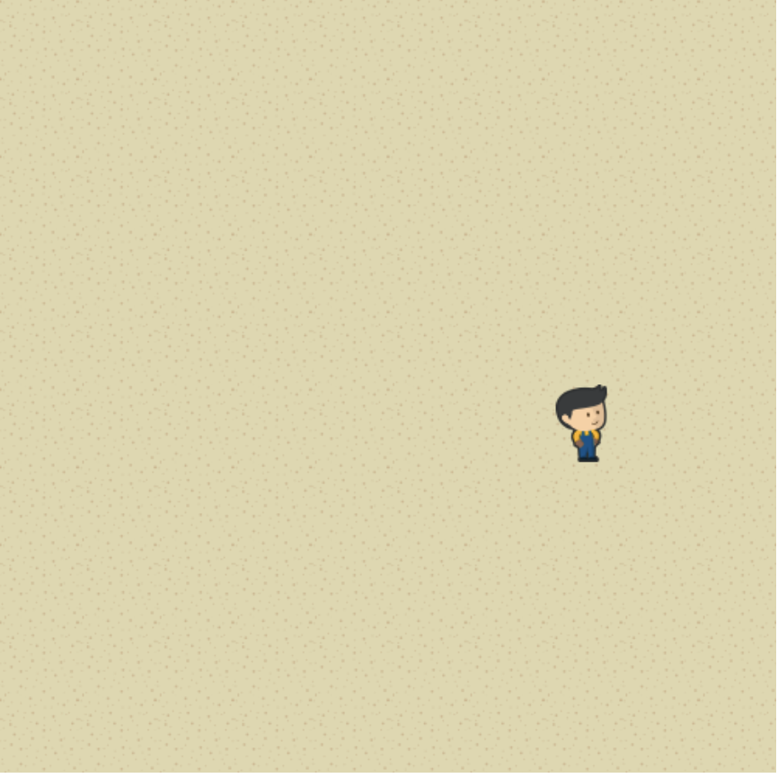
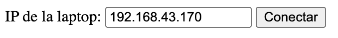

## Ejemplo de Acelerómetro

Este repo es una prueba para usar el celular como joystick para Wollok Game.

En esta primera prueba queremos controlar al jugador con el _acelerómetro_.

### Controlá al jugador usando tu celular ➡️ 📱

⚠️ Necesitás tener la compu y el celu en la misma red wifi 🛜 preferentemente al _hotspot_.

1. Clonate y levantá este juego Wollok desde el VSCode (como lo harías normalmente). 
Fijate que el en la terminar te diga:
`Ya podés conectar tu celular a ws://localhost:8080`
Asegurate de que el juego se vea en la pantalla.


2. Desde otra consola, entrá a la carpeta `web` en este repo y ejecutá
  - `npm install`
  - `npm run dev`

  Eso debería servir una página web por el protocolo `https`. Por ejemplo
  ```
    VITE v8.3.1  ready in 154 ms
  ➜  Local:   https://localhost:5173/
  ➜  Network: https://192.168.43.170:5173/  en0
  ➜  press h + enter to show help
  ```

3. Desde el celu, entrá al sitio que levanteste antes (Network). 
> Siguendo este ejemplo debería ser https://192.168.43.170:5173/

Acá deberías ver el sitio web que tiene un campo de texto y un botón de "Conectar"



4. Asegurate que diga la misma ip que la compu (Network) y apretá `Conectar`.
> En este caso sería `192.168.43.170`

5. Ya podés controlar al personaje agitando tu celu 🫨
> Fijate que al conectarse la terminal del juego diga `✓ Celular conectado`